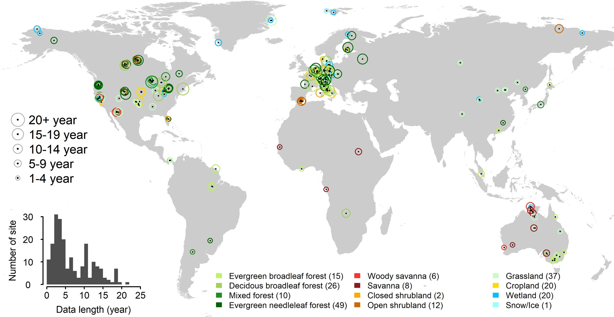
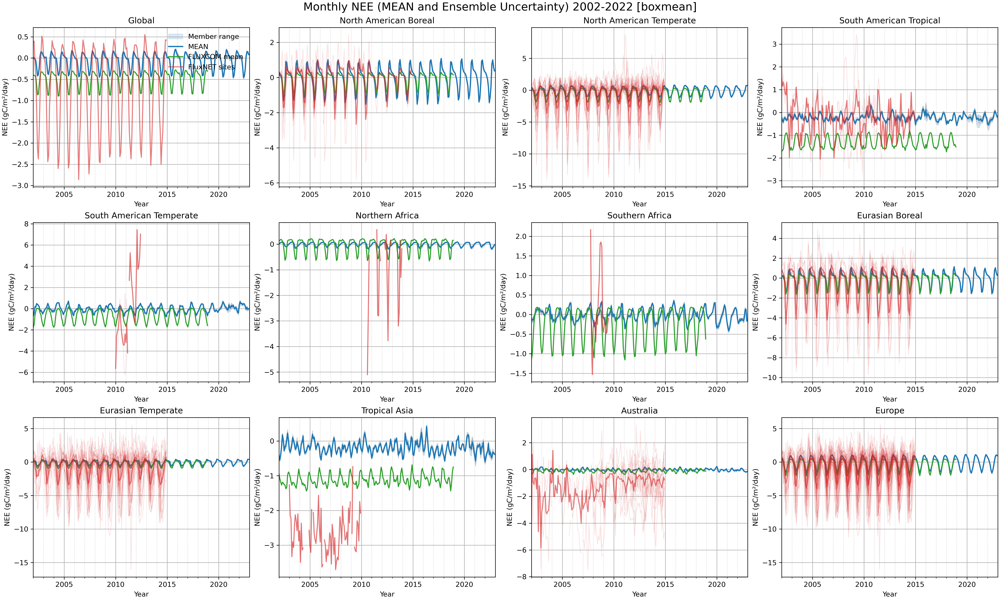

# PROFESSIONAL_WG_land_eval

Weather Generator Land evaluation

This repository contains a small toolkit to compute monthly-mean NEE from daily model output, and to visualize regional NEE time series with optional FluxNET site overlays and optional FLUXCOM gridded comparison.

The workflow is:
- Create monthly NEE means per ensemble member from daily NetCDF files (create_NEE_month_mean_in_days.bash)
- Plot regional time series from those monthly means with optional FluxNET/FLUXCOM overlays (plot_NEE_regions.py)
- Optionally pick representative FluxNET sites and file paths per region for CSV overlays (build_fluxnet_site_map.py)
- Optionally submit jobs on an LSF cluster (submit_script.bash)

## Directory conventions
- Input daily files (model archive): /data/products/CERISE-LND-REANALYSIS/archive/streams/final_archive/{YYYY}/output_history_YYYY-MM-DD/*.clm2_####.h0.YYYY-MM-DD-00000*.nc
- Monthly means output: ./data/out/NEE_monthmean_YYYY_MM_####.nc (or ..._mean.nc for ensemble mean, if produced)
- Figures output: ./data/figures_out
- FluxNET CSVs: ./data/FluxNET
- FLUXCOM monthly files: ./data/FluxComm/CarbonFluxes/RS_METEO/ensemble/ERA5/monthly/NEE.RS_METEO.FP-NONE.MLM-ALL.METEO-ERA5.720_360.monthly.YYYY.nc

## About FluxNET

The FLUXNET2015 Database is the result of years of collaboration among the FLUXNET2015 data team to prepare and process data from regional networks around the world.  This team included The AmeriFlux Project Management, the European Ecosystem Fluxes Database, and the ICOS Ecosystem Tematic Centre (ICOS-ETC).  FLUXNET2015 encompasses 212 flux sites and over 1500 site-years of data from a range of ecosystem types (Pastorello et al, 2019) (Figure below), and has contributed to a large and growing body of ecosystem research.

https://www.nature.com/articles/s41597-020-0534-3

The variable proposed in the SUBSET product is NEE_VUT_REF since it maintains the temporal variability (as opposed to the MEAN NEE), it is representative of the ensemble, and the VUT method is sensitive to possible changes of the canopy (density and height) and site setup, which can have an impact on the turbulence and consequently on the USTAR threshold. 

The dataset is distributed in files separated by sites, by temporal aggregation resolutions (e.g., hourly, weekly), and by data products (e.g., FULLSET with all the variables and SUBSET designed for less experienced users).

In this work, the monthly dataset were used, in order to compare with the monthy NEE calculated from the Spreads-Land system.

---

## 1) create_NEE_month_mean_in_days.bash
Compute monthly means of NEE (gC m-2 day-1) for each ensemble member, starting from daily NetCDF files.

Key points
- Uses CDO (tested with intel-2021.6.0/cdo-threadsafe/2.1.1) and sets HDF5_USE_FILE_LOCKING=FALSE
- Skips and logs missing/invalid daily files (not_found_filesTIMESTAMP.log)
- Filters inputs to files that contain variable NEE and a valid time axis
- Parallelizes CDO calls up to MAX_PARALLEL_CDO jobs
- Converts from per-second to per-day using -mulc,86400 and then computes monthly mean with -monmean

Adjustable variables inside the script
- OUT_DIR: output folder for monthly means (default ./data/out)
- YEAR_START, YEAR_END: inclusive year range to process
- START_MONTH, LAST_MONTH: month range (1–12). START_DAY defaults to 1
- MEMBERS: list of ensemble member IDs (e.g., 0001..0030). Use "????" if you instead produce a mean across files
- BASE_ROOT: root of the daily model archive
- MAX_PARALLEL_CDO: limit on concurrent background cdo jobs

Typical usage
1) Edit variables near the top of the script to match your environment
2) Run
   ./create_NEE_month_mean_in_days.bash

Output
- One NetCDF per month per member: NEE_monthmean_YYYY_MM_####.nc
- Attribute units set to gC m-2 day-1

Notes
- Certain days (e.g., 2006-01-01 and 2007-01-01) may have inconsistent metadata; they are skipped and logged

---

## 2) plot_NEE_regions.py
Read monthly-mean NEE files and plot regional time series. Supports two modes:
- all: 12 predefined regions as subplots with ensemble spread
- single: one region full-width, with optional FluxNET CSV overlay and/or FLUXCOM comparison

Predefined regions and their bounds are baked into the script (Global, North American Boreal, North American Temperate, South American Tropical, South American Temperate, Northern Africa, Southern Africa, Eurasian Boreal, Eurasian Temperate, Tropical Asia, Australia, Europe). Each region also has a representative FluxNET site used when selecting a single nearest grid cell (spatial-agg=nearest_site).

Spatial aggregation within a region
- boxmean: area-weighted mean over all grid cells in the region bounds (default)
- nearest_center: single grid cell nearest to the region box center
- nearest_site: single grid cell nearest to the representative site coordinates

Command-line arguments (defaults shown)
- --in-dir ./data/out: folder with NEE_monthmean_YYYY_MM_*.nc files
- --out-dir ./data/figures_out: where figures are saved
- --start-year 2002 --end-year 2022: time window to assemble and plot
- --mode {all,single}: layout mode (all = 12 subplots; single = one region)
- --region "South American Tropical": region to plot in single mode
- --spatial-agg {boxmean,nearest_center,nearest_site}: how to aggregate grid cells
- --fluxnet-csv <file.csv>: optional path to a FluxNET CSV to overlay in single mode
- --fluxnet-timestamp-col TIMESTAMP: name of timestamp column
- --fluxnet-value-col NEE_VUT_REF: name of the column with NEE
- --fluxnet-timestamp-fmt %Y%m: timestamp format in the CSV
- --compare {none,fluxnet,fluxcom,both}: control comparison overlays; none = no external overlay, fluxnet = only FluxNET sites, fluxcom = only FLUXCOM gridded, both = FluxNET + FLUXCOM
- --fluxcom-dir ./data/FluxComm/CarbonFluxes/RS_METEO/ensemble/ERA5/monthly: folder with FLUXCOM monthly files (one per year)

All overlays and the x-axis are restricted to the requested time window [START_YEAR-01-01, END_YEAR-12-31].

FluxNET overlays
- By default (when site mappings are available), all region sites are overlaid:
  - Individual site series are drawn as faint red lines (alpha=0.1)
  - The time-aligned mean across those sites is drawn as a prominent red line (alpha=0.6) labeled "FluxNET sites"
- Global region: only the mean line is plotted (individual site lines are suppressed)
- Single mode with --fluxnet-csv: the provided CSV is drawn in orange in addition to the site overlays and mean
- CSV parsing uses the --fluxnet-* options; rows with -9999 are ignored
- In "all" mode the legend is consolidated in the first subplot; the "FluxNET sites" entry is guaranteed to appear if any region includes site overlays

FLUXCOM comparison
- Reads yearly FLUXCOM files and extracts each calendar month (variable NEE; units gC m-2 d-1; missing_value -9999)
- Uses the same --spatial-agg as the model dataset:
  - boxmean: area-weighted mean over the region on the FLUXCOM grid
  - nearest_center / nearest_site: nearest FLUXCOM grid cell to the target point
- Plotted as a green line labeled "FLUXCOM mean"
- File pattern expected per year: NEE.RS_METEO.FP-NONE.MLM-ALL.METEO-ERA5.720_360.monthly.YYYY.nc (configurable via --fluxcom-dir)

Examples
- Plot all regions with defaults
  python plot_NEE_regions.py --mode all --in-dir ./data/out --out-dir ./data/figures_out

- Plot all regions comparing to FLUXCOM only (box-area mean)
  python plot_NEE_regions.py --mode all --compare fluxcom --spatial-agg boxmean \
                             --in-dir ./data/out --out-dir ./data/figures_out

- Plot all regions comparing to both FluxNET and FLUXCOM
  python plot_NEE_regions.py --mode all --compare both --in-dir ./data/out --out-dir ./data/figures_out

- Plot a single region using nearest site grid cell and overlay a specific CSV
  python plot_NEE_regions.py --mode single --region "South American Tropical" \
                              --spatial-agg nearest_site \
                              --fluxnet-csv ./data/FluxNET/FLX_BR-Sa3_FLUXNET2015_SUBSET_MM_2000-2004_1-4.csv

Expected outputs
- All regions: ./data/figures_out/NEE_monthly_means_START_END.png
- Single region: ./data/figures_out/NEE_monthly_{valuecol}_{Region}_{START}_{END}.png

Example figure

---

## 3) build_fluxnet_site_map.py
Pick representative FluxNET sites per region and build a mapping from SITE_ID to a preferred file for overlays.

Inputs expected in ./data/FluxNET
- FluxNET_sites.csv: must contain columns SITE_ID, LOCATION_LAT, LOCATION_LONG
- FluxNET_sites_info.csv: must contain columns SITE_ID, filename, filetype, and optionally start_year, end_year, timestamp

What it does
- Filters FluxNET_sites_info.csv to filetype=FLUX-MET and the requested subset level (e.g., _SUBSET_MM_)
- Selects the “best” row per SITE_ID by longest coverage and latest timestamp (when available)
- Supports three selection modes:
  - Single region: select the nearest site to the region’s center among allowed SITE_IDs
  - --all-regions: select one representative site per predefined region
  - --all-sites: list all available SITE_IDs per region (excluding Global) and provide a representative LOCATION_LAT/LONG per region; also build a site_id_to_file mapping for best files per site
- Outputs JSON tailored to the chosen mode (see below)

Usage
- Single region
  python build_fluxnet_site_map.py --region "South American Tropical" --subset MM --out-json ./data/FluxNET/site_map_SAT_MM.json

- All regions (one representative site per region)
  python build_fluxnet_site_map.py --all-regions --subset MM --out-json ./data/FluxNET/site_map_all_MM.json

- All sites per region (full site lists for overlays)
  python build_fluxnet_site_map.py --all-sites --subset MM --out-json ./data/FluxNET/site_map_all_sites_MM.json

Output
- Single region:
  {
    "selected_region": "...",
    "selected_site": {"SITE_ID": "...", "LOCATION_LAT": ..., "LOCATION_LONG": ...},
    "site_id_to_file": {"SITE_ID": "./data/FluxNET/<filename>.csv", ...}
  }
- --all-regions:
  {
    "region_to_site": {"Region": {"SITE_ID": "...", "LOCATION_LAT": ..., "LOCATION_LONG": ...}, ...},
    "site_id_to_file": {"SITE_ID": "./data/FluxNET/<filename>.csv", ...}
  }
- --all-sites (recommended for multi-site overlays):
  {
    "regions": {"Region": {"SITE_IDS": ["SITE_ID", ...], "LOCATION_LAT": ..., "LOCATION_LONG": ...}, ...},
    "site_id_to_file": {"SITE_ID": "./data/FluxNET/<filename>.csv", ...}
  }

Notes
- The "Global" region is not explicitly listed under "regions" for --all-sites, but you can derive a global overlay by aggregating across every SITE_ID in site_id_to_file.

---

## 4) submit_script.bash
Thin wrapper to submit a script to an LSF batch system.

Customize near the top
- SCRIPT_NAME: path to the script you want to run (e.g., ./create_NEE_month_mean_in_days.bash or plot_NEE_regions.py)
- Resources: queue (-q), walltime (-W), memory, project, etc.

Usage
- Set SCRIPT_NAME to the target script, then run
  ./submit_script.bash

- Standard output/error are written to a timestamped .log file next to the script

---

## Quick start
1) Generate monthly means (edit year range, members, paths as needed)
   ./create_NEE_month_mean_in_days.bash

2) Plot all regions for a given period
   python plot_NEE_regions.py --mode all --start-year 2002 --end-year 2022 \
                              --in-dir ./data/out --out-dir ./data/figures_out

   Compare against FLUXCOM only
   python plot_NEE_regions.py --mode all --start-year 2002 --end-year 2022 \
                              --compare fluxcom --in-dir ./data/out --out-dir ./data/figures_out

   Compare against both FluxNET and FLUXCOM
   python plot_NEE_regions.py --mode all --start-year 2002 --end-year 2022 \
                              --compare both --in-dir ./data/out --out-dir ./data/figures_out

3) (Optional) Build FluxNET site map JSONs for overlays
   python build_fluxnet_site_map.py --all-regions --subset MM --out-json ./data/FluxNET/site_map_all_MM.json

Outputs will appear under ./data/out (NetCDF) and ./data/figures_out (PNGs), e.g. the example figure above.
